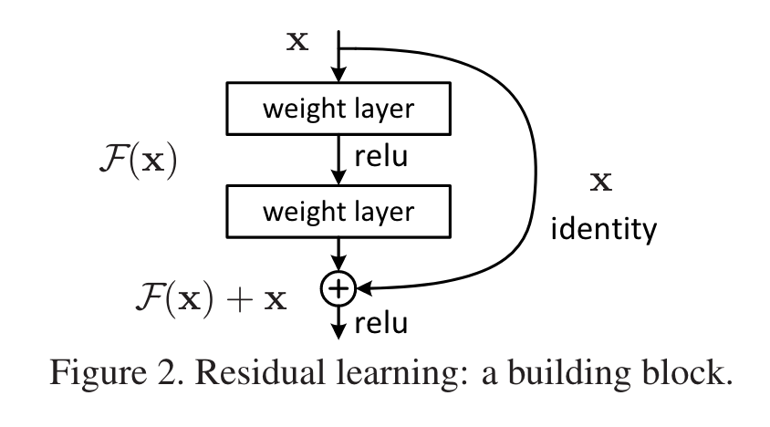
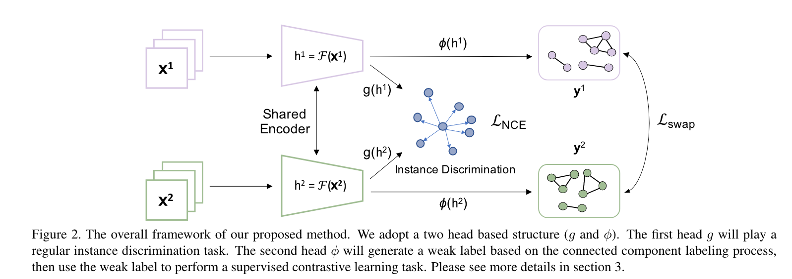
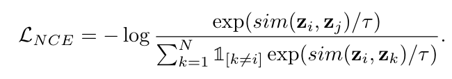
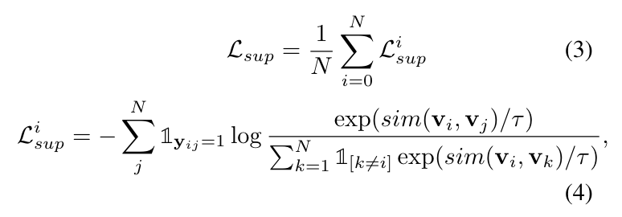
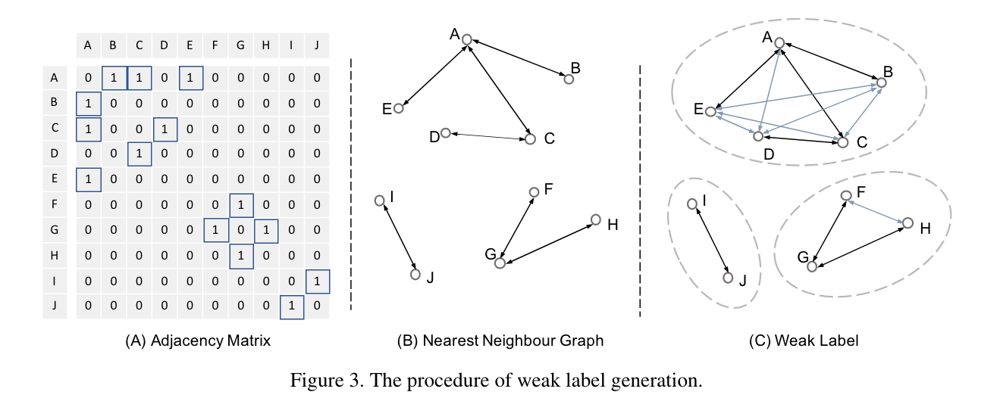
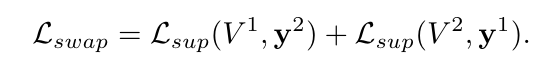
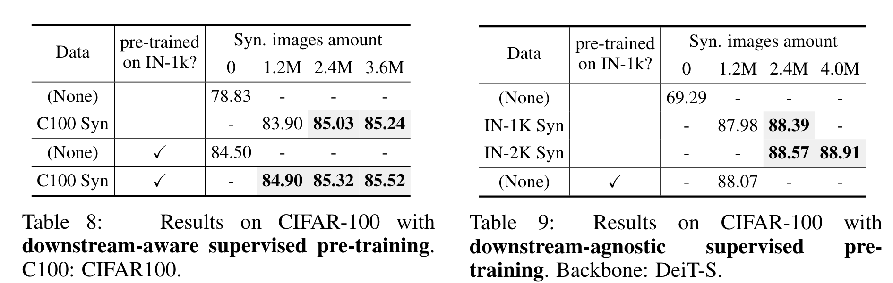
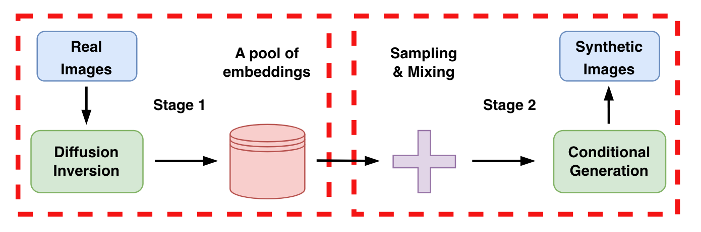

[toc]

# 学习资料
突然发现看过学过的东西很容易忘，好记性不如烂笔头，整理一下日常学习笔记，忘了好来翻一翻

## 1. ML

## 2. DL-basic

### 2.1.1 Transformer

#### 2.1.1.1 Attention is all you need

architechture:


1. 相较于RNN，原话：“This inherently sequential nature precludes parallelization within training examples, which becomes critical at longer sequence lengths, as memory constraints limit batching across examples.” 说人话就是，RNN是sequential，不能并行计算，序列长度很长的话，就会要求很大内存。
“allowing modeling of dependencies without regard to their distance in the input or output sequences” 还能消除长距离依赖

2. self-attention: "Self-attention, sometimes called intra-attention is an attention mechanism relating different positions of a single sequence in order to compute a representation of the sequence."  结合一个序列的不同位置来计算representation of the sequence, 也就是自己的q k v 都是自己

3. decoder中，使用masked attention：“ensures that the predictions for position i can depend only on the known outputs at positions less than i.” 因为attention是每个position对其他position的，然后这里使用的是自回归（decoder的输入是encoder输入的shifted right），所以说在预测i position时 只能使用i position之前的信息，所以用masked的方法把后面的给去掉，具体就是设为-inf，在softmax的时候会变为0.

4. **Scaled Dot-Product Attention**:


**not batched**:
q: [tgt_len, dk]
k: [src_len, dk]
v: [src_len, dv]
一般来说，d_model = dk = dv = embed_dim，
qkT: [tgt_len, src_len]，也就是对于tgt_len个query来说，分配到src_len个key的weights。再```softmax(dim=-1)```，把每个query分配到key的weights的sum 搞为1.
再矩阵乘上v，得到attention：[tgt_len, dv]，也就是对于tgt_len个query来说，分配到src_len个key的value
为什么要除sqrt(dk)：“We suspect that for large values of dk, the dot products grow large in magnitude, pushing the softmax function into regions where it has extremely small gradients. To counteract this effect, we scale the dot products by 1 √dk .”。也就是说，如果embed_dim很大，因为是求内积嘛，加起来可能会很大（很相似），那最大最小就会相差很大，再进softmax就会有很小很小的梯度，所以就要除。至于为什么是sqrt(dk)，个人猜测，想想L2。
**Batched**:
q: [batch_size, tgt_len, dk]
k: [batch_size, src_len, dk]
v: [batch_size, src_len, dv]
类似的，用```torch.bmm``` 做批矩阵乘

5. **Multi-Head Attention**

简单来说就是，h是头的个数，把embed_dim分成h份，每一份单独过linear和Scaled Dot-Product Attention，最后concat成一份，过最后的linear。
为什么要多头？“Multi-head attention allows the model to jointly attend to information from different representation subspaces at different positions. With a single attention head, averaging inhibits this.” 说得很有道理，咱也别问为什么了。

公式很好懂。W是linear层
* 至于代码怎么实现，很牛逼，直接把头的维度弄到batch里

6. **Position-wise Feed-Forward Networks**
$$ FFN(x) = max(0, xW_1 + b_1)W_2 + b_2 $$
也就是两个线性层，中间ReLU激活。这里的两个W，可以转换d的大小，也就是feed forward里面的embedding的dim，功能有点像两个size 1 的卷积核。

7. **embedding and softmax**
这里提到，两个embedding层 以及最后的pre-softmax层 的weight matrix是共享的

8. **Positional Encoding**
$$PE_{(pos, 2i)} = sin(\frac{pos}{10000^\frac{2i}{d_{model}}})$$
$$PE_{(pos, 2i + 1)} = cos(\frac{pos}{10000^\frac{2i}{d_{model}}})$$

因为输入是 ```n x d```的，那么位置编码也要与之对应，所以pos对应n，i对应d

可以看出，这样的位置编码是fixed。
为什么选择这样的位置编码？“we hypothesized it would allow the model to easily learn to attend by relative positions, since for any fixed offset k, PEpos+k can be represented as a linear function of PEpos.”
主要是**relative positions**，sin(pos)可以是sin(pos + k)的线性表示
虽然这么解释，但还是不太理解为什么


### 2.1.2 ResNet

#### 2.1.2.1 Deep Residual Learning for Image Recognition

残差连接：

面对的问题是当网络很深时，反而效果会很差。那么为什么这样设计，思路：考虑一个较浅的网络，我们给他增加层，如果增加的层是一个identity mapping（恒等映射），那么这个更深的网络的训练误差是不会比其较浅的高的（因为都一样），也就是说理论上，更深的网络的训练误差是可能不比浅的网络的误差高的。

有了理论，那为什么会出现这种现象呢，就是学习的难易程度不一样。

‘If one hypothesizes that multiple nonlinear layers can asymptotically approximate complicated functions, then it is equivalent to hypothesize that they can asymptotically approximate the residual functions, i.e., H(x) − x’。 一样使用好几层非线性层来学，我如果能学成H(x), 那我也能学成H(x) - x，既然如此就挑一个好学的学呗，**H(x) - x** 好学。这里H(x) 和 x需要是相同维度

原因：
1. 与其每一层让他去学习一个underlying mapping（unreferenced mapping），不如基于学习到的东西再去学习。那么怎么基于已经学习到了的东西呢，就是去学残差（这不就是boosting的思想吗？？）。同时这样的设计在计算上也非常好实现，直接加上就好。
2. ‘The degradation problem suggests that the solvers might have difficulties in approximating identity mappings by multiple nonlinear layers.’ 那么多层呢，如果映射关系本来就很简单，很早就学完了，那么后面的layer应该是identify mapping，这里说 由于degradation problem，很难做到identity mapping，所以如果用残差，直接至0就完事儿啦。当然实际上可能不是typical identity mapping，可能是很多微小的扰动，当然残差对这些微小扰动肯定也会更敏感。

**Bottleneck building block**:

左边是较浅的网络的building block，如resnet-34。右边是给较深的，如50，101，152。这样设计呢是为了减少训练开支。
**这里的1x1卷积就用得非常精髓，用来改变通道数**，可以让3x3层成为最小的输入输出的“瓶颈”。

### 2.1.3 ViT 

#### 2.1.3.1 An image is worth 16x16 words: Transformers for image recognition at scale


## 2.2 NLP

### 2.2.1 Bert


## 2.3 CV

### 2.3.1 self-supervised

#### 2.3.1.1 Weakly Supervised Contrastive Learning
MK师兄的论文，主要是解决label很少的图像分类任务



原有的loss between positive pair i, j：

这里的问题在于，这会让两个属于相同class的positive sample的similarity变小（分母），虽然会让这个positive pair i, j的similarity变大（分子），叫做 instance discrimination。所以这里这个损失函数可以改良一下：

这里的y表示i，j 是否是同一个class
那么怎么整这个y出来呢？
简单来说，对于一个batch，每个样本有一个embedding vector，然后对每个样本找1- nearest neighbor，这样的pair就连起来。那么问题就很轻易的转化为，给定一组nodes和edges，找每个联通量，每个联通量属于同一个weak label。

好处： parameter-free，reciprocal，deterministic process

这swapped version是啥子意思？？

这y是怎么当label的，咋加到公式里？

还有一个问题是，multi-crop可以提高representation的质量。但是怎么剪，也是有说法的。光增加数量肯定不行，不光会增加计算量，还会overlap。这里用了KNN based low-resolution multi-crop strategy 来解决这两个问题。因为每个epoch都会产生一个primary feature h1，基于此用KNN来找每个sample的crops，用于下个epoch的训练。

### 2.3.2 synthetic data for image classification

#### 2.3.2.1 IS SYNTHETIC DATA FROM GENERATIVE MODELS READY FOR IMAGE RECOGNITION?

focus on two perspectives: synthetic data for improving classification models in **data-scarce** settings (i.e. zero-shot and fewshot), and synthetic data for large-scale model pre-training for **transfer learning**.

**用 sota t2i generative model 来做image recognition.**

用GLIDE来生成，CLIP来分类

对于measuring of diversity，用CLIP的feature来做(算两个的correlation)，text和image都可以算

1. zero-shot

如何生成：
Basic strategy: 用label names **as** prompts to generate image，用这text和对应的image来训练classifier (冻结feature extractor)。具体实现：2000 synthetic images for each class
Language enhancement: 用llm来word2sentence as prompts. 具体实现：200 sentences for each class. 2000 synthetic images for each class.


如何增加diversity：
用llm，t5，word2sentence

如何减少noise，增加robustness：
word2sentence过程可能会引入noise，那么就要验证其quality。这里的方法是不管text如何，就用CLIP的zero shot classification confidence filter来验证image的质量。至于robustness，就是对loss进行一些调整。

主要结果：
synthetic data确实有用，且只tune classifier的结果最好，参数tune更多效果会变差。这感觉就是clip本来就很牛逼的原因。
然后这里也验证了 如果用resnet来训的话(CIFAR100，这里应该就不是zero-shot)，accuracy会爆低。还有一个有趣的现象是，本来每个class是500张，如果减少的95张，效果也差不多，说明其实信息是冗余的，只堆数量肯定不行，要提取更多信息。（不是，做real shot比 clip的zero shot准确度还低。。

2. few shot

如何生成：
吸取zero shot的经验，用Language enhancement + filter来作为basic strategy. 
基于此，又有两个strategy:
Real Filtering: 用real data 来验证 synthetic data
Real Guidance: 用 real data 作为生成图的基础。很像 add conditional control to t2i
结果是Real Guidance 最好，Real Filtering其次

训练：
这里又提出两种训练方法，一个是phrase-wise(real data 和 synthetic data 分别训练)，一个是混合。结果是混合的比较好。**都是只训练classifier**。
这里还使用了 frozen BN. 冻结的话就是保留预训练的东西，如果不冻结有害，说明这个新数据集和原数据集差异很大(synthetic)，或者是数量太少(real data)


3. for pre-training for transfer learning

使用 synthetic data来pre-train模型，这里用了resnet50 和 ViT作为backbone，后者稍好。

那么这里可分为两类：
downstream-aware 也就是对下游任务有感知，比如说下游是对CIFAR100进行分类，那么在预训练时，就可以使用这些label信息。
downstream-agnostic，对下游任务没有感知，这里使用了relatively general and diverse label space such as ImageNet-1K。(这里还提到使用了supervised 和 self-supervised 两种预训练方法，我不太了解具体的self-supervised的做法，就先不看了)



上图结论：用synthetic来pre-train效果没用ImageNet效果好(但是差的很少，提高数量甚至能超过，这是比较令人惊讶的)，但比没pre-train效果好。如果pre-train on ImageNet，再pre-train on synthetic data，效果更好但很少。提高synthetic data的数量，效果也会提高但很少。


***总结：***
这篇可以总结为两部分
利用synthetic data来微调pre-trained模型(这里是强大的clip)。
利用synthetic data来pre-train 模型，再用“好”的数据集(balanced, adequate) CIFAR 来验证其性能。

不同点：
我是用synthetic + real 来train一个模型，可以用resent。(也就是他在文中只提了一嘴性能很低的地方)
当然如果要用在大数据集如ImageNet上预训练好的权重，或者是用到clip来微调的话，是会与这篇重叠，可以再思考下加点啥

可借鉴之处：
很多地方都能借鉴哇
不同strategy的使用和对比。
比如，单用label的信息来generate， 用label信息to sentence来generate，  用label信息 to sentence + original image 做 conditional generation。 这三者相比

是否还可以加上不同diffusion model的对比？

#### 2.3.2.2 Diversity is Definitely Needed: Improving Model-Agnostic Zero-shot Classification via Stable Diffusion

任务：ModelAgnostic Zero-Shot Classification，
'training non-specific classification architectures (downstream models) to classify real images without using any real images during training'
全用synthetic data 训练 下游模型

着重于 增加diversity

生成图像：stable diffusion
分类：resnet(with pre-trained ImageNet weights), ViT. 他这里又说是Zero-shot，我个人理解他Model Agnostic Zero-Shot Classification (MA-ZSC)的意思应该是 没有用到任何原有class数据来训练，但是有哪些class是知道的。基本用的都是resnet，最后vit来比较

这里还用了原数据集中的图片：‘More explicitly, we randomly sample 1% of the images for each class in CIFAR10 [13], totalling 60 images per class. These images were then encoded using CLIP’s image encoder to obtain their feature representations. Next, we perform linear interpolation of these representations and use the interpolated feature representation as conditioning for the diffusion image generation process.’
比如说每个class有60张图(real data)，随机选3张出来avg，作为diffusion的初始。那这不是也用到了原始数据吗。。。

最重要最神秘的part， 用来提升diversity的bag of tricks！：
举了几种prompt方法：
“an image of a {class}”
“an photo of a {class}”
“{class}”
“a {domain} of a {class}”，这里domain可以是photo, drawing, painting, sketch, collage, poster, digital art image, rock drawing, stick figure, 3D rendering(CIFAR)，且不同数据集的domain不一样，还是面向数据集的。
还有就是调整Random Unconditional Guidance
然后 结合起来就大大提升diversity了
感觉如果用chatgpt来生成 prompts 应该是会更diverse

***总结：***
说是zero-shot，看下来好像还是会用到原始数据(使用class信息，和 使用原数据来generate data两种)。
使用全synthetic data来训练模型，用了resnet，with pre-trained ImageNet weights

不同点：
如果任务是longtail，那么其实就可以使用原始数据，用其来获取synthetic data。
用chatgpt来提升diversity

可借鉴部分：
在用chatgpt的时候，可以加入 domain。

#### 2.3.2.3 Training on Thin Air: Improve Image Classification with Generated Data


与prompt-base 的方法不同，这篇主要是将real data encoder到embedding，再添加noise来增加diversity，然后通过这个来生成数据。
‘In the first stage, we map each image to the model’s latent space, generating a dataset of latent embedding vectors. Then, we produce novel image variants by running the inverse diffusion process conditioned on perturbed versions of these vectors.’

感觉设计到stable diffusion的结构，有点看不懂

***总结：***
非 prompt-base 

可借鉴之处：
探究与data augmentation tech 的 compatibility
探究quality of generative model， size of dataset 与 performance的关系

#### 2.3.2.4 Synthetic Data from Diffusion Models Improves ImageNet Classification

仅在ImageNet上

方法：
1. 找各个分辨率的SOTA(基于FID, IS) 生图模型。
2. 用这些模型生成SOTA 数据(基于CAS)
3. 用这些数据(combining synthetic data with real data) 训练分类模型

使用FID或者是IS来作为 synthetic data 的 quality的评价指标不合适，可能会造成该评价指标和最终分类效果的不一致。这里提出使用classification accuracy score (CAS) ，'measures classification performance on the ImageNet validation set for ResNet-50 models [20] trained on generated data.'

介绍了一系列 怎么把large-scale text-to-image model fine-tune成 专门为ImageNet生成 synthetic data 的模型

***总结：***
用real data来fine tune 生图模型，使其成为一个为下游分类任务的模型。再用该模型生图来train分类模型。

可借鉴之处：
CAS，可以考虑如何把这个加进去，比如说先用longtail数据train，然后synthetic data过一遍这个模型来filtering，然后再用 balanced (syn + real) train第二阶段
不同分辨率的影响


