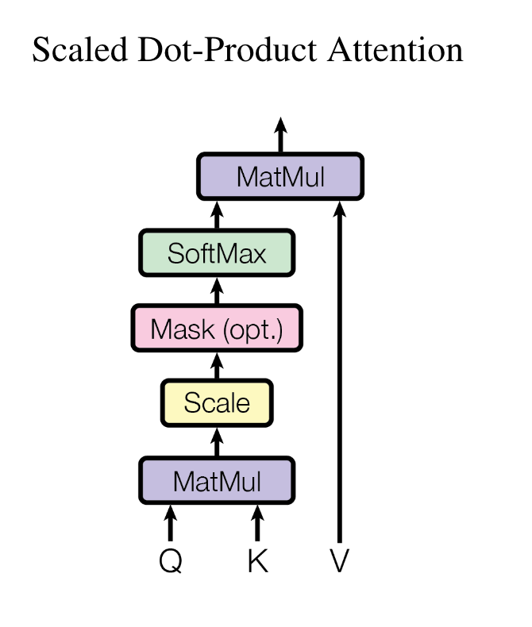
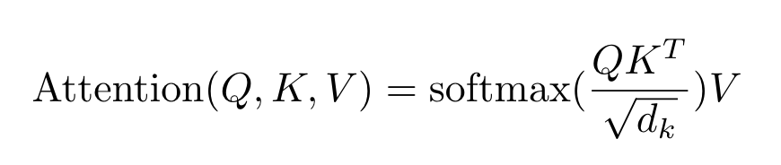
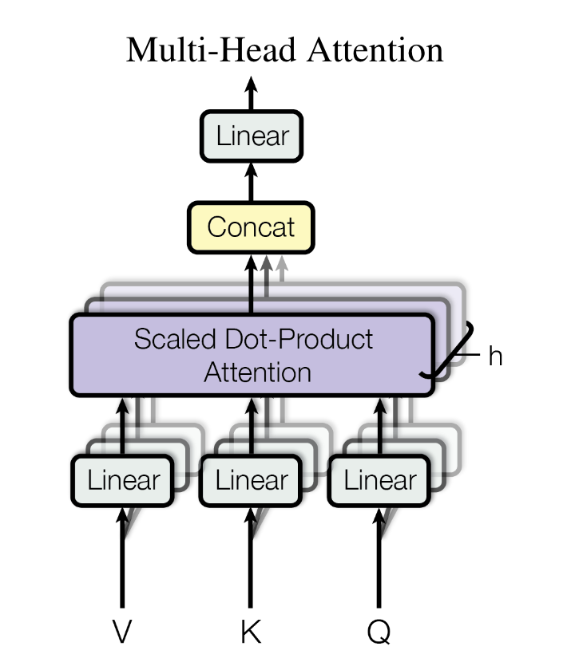
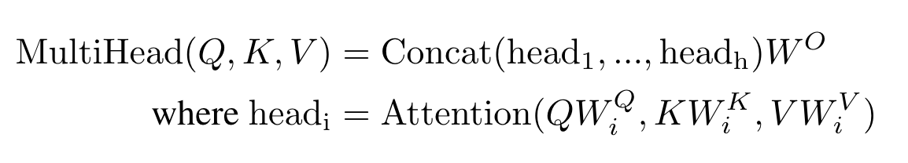

[toc]

# 学习资料
突然发现看过学过的东西很容易忘，好记性不如烂笔头，整理一下日常学习笔记，忘了好来翻一翻

## 1. ML

## 2. DL

### 2.1 Basic

#### 2.1.1 Transformer

* [Attention is all you need! ](https://arxiv.org/pdf/1706.03762.pdf)

architechture:


1. 相较于RNN，原话：“This inherently sequential nature precludes parallelization within training examples, which becomes critical at longer sequence lengths, as memory constraints limit batching across examples.” 说人话就是，RNN是sequential，不能并行计算，序列长度很长的话，就会要求很大内存。
“allowing modeling of dependencies without regard to their distance in the input or output sequences” 还能消除长距离依赖

2. self-attention: "Self-attention, sometimes called intra-attention is an attention mechanism relating different positions of a single sequence in order to compute a representation of the sequence."  结合一个序列的不同位置来计算representation of the sequence, 也就是自己的q k v 都是自己

3. decoder中，使用masked attention：“ensures that the predictions for position i can depend only on the known outputs at positions less than i.” 因为attention是每个position对其他position的，然后这里使用的是自回归（decoder的输入是encoder输入的shifted right），所以说在预测i position时 只能使用i position之前的信息，所以用masked的方法把后面的给去掉，具体就是设为-inf，在softmax的时候会变为0.

4. **Scaled Dot-Product Attention**:


**not batched**:
q: [tgt_len, dk]
k: [src_len, dk]
v: [src_len, dv]
一般来说，d_model = dk = dv = embed_dim，
qkT: [tgt_len, src_len]，也就是对于tgt_len个query来说，分配到src_len个key的weights。再```softmax(dim=-1)```，把每个query分配到key的weights的sum 搞为1.
再矩阵乘上v，得到attention：[tgt_len, dv]，也就是对于tgt_len个query来说，分配到src_len个key的value
为什么要除sqrt(dk)：“We suspect that for large values of dk, the dot products grow large in magnitude, pushing the softmax function into regions where it has extremely small gradients. To counteract this effect, we scale the dot products by 1 √dk .”。也就是说，如果embed_dim很大，因为是求内积嘛，加起来可能会很大（很相似），那最大最小就会相差很大，再进softmax就会有很小很小的梯度，所以就要除。至于为什么是sqrt(dk)，个人猜测，想想L2。
**Batched**:
q: [batch_size, tgt_len, dk]
k: [batch_size, src_len, dk]
v: [batch_size, src_len, dv]
类似的，用```torch.bmm``` 做批矩阵乘

5. **Multi-Head Attention**

简单来说就是，h是头的个数，把embed_dim分成h份，每一份单独过linear和Scaled Dot-Product Attention，最后concat成一份，过最后的linear。
为什么要多头？“Multi-head attention allows the model to jointly attend to information from different representation subspaces at different positions. With a single attention head, averaging inhibits this.” 说得很有道理，咱也别问为什么了。

公式很好懂。W是linear层
* 至于代码怎么实现，很牛逼，直接把头的维度弄到batch里


### 2.2 NLP

#### 2.2.1 Bert

### 2.3 CV


## 3. leetcode

### 链表

#### 160 相交链表
分别考虑两种情况：相交，不相交。
方法：两个链表一起开始，走完就换到另一个的头开始。直到两个指针所指相同
分别考虑两种情况的路程