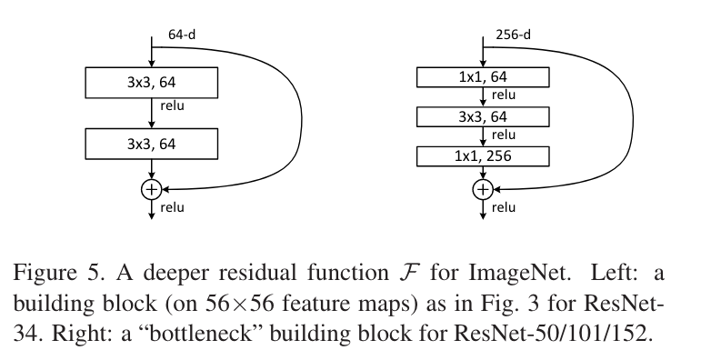

[toc]

# 学习资料
突然发现看过学过的东西很容易忘，好记性不如烂笔头，整理一下日常学习笔记，忘了好来翻一翻

## 1. ML

## 2. DL-basic

### 2.1.1 Transformer

* [Attention is all you need! ](https://arxiv.org/pdf/1706.03762.pdf)

architechture:


1. 相较于RNN，原话：“This inherently sequential nature precludes parallelization within training examples, which becomes critical at longer sequence lengths, as memory constraints limit batching across examples.” 说人话就是，RNN是sequential，不能并行计算，序列长度很长的话，就会要求很大内存。
“allowing modeling of dependencies without regard to their distance in the input or output sequences” 还能消除长距离依赖

2. self-attention: "Self-attention, sometimes called intra-attention is an attention mechanism relating different positions of a single sequence in order to compute a representation of the sequence."  结合一个序列的不同位置来计算representation of the sequence, 也就是自己的q k v 都是自己

3. decoder中，使用masked attention：“ensures that the predictions for position i can depend only on the known outputs at positions less than i.” 因为attention是每个position对其他position的，然后这里使用的是自回归（decoder的输入是encoder输入的shifted right），所以说在预测i position时 只能使用i position之前的信息，所以用masked的方法把后面的给去掉，具体就是设为-inf，在softmax的时候会变为0.

4. **Scaled Dot-Product Attention**:


**not batched**:
q: [tgt_len, dk]
k: [src_len, dk]
v: [src_len, dv]
一般来说，d_model = dk = dv = embed_dim，
qkT: [tgt_len, src_len]，也就是对于tgt_len个query来说，分配到src_len个key的weights。再```softmax(dim=-1)```，把每个query分配到key的weights的sum 搞为1.
再矩阵乘上v，得到attention：[tgt_len, dv]，也就是对于tgt_len个query来说，分配到src_len个key的value
为什么要除sqrt(dk)：“We suspect that for large values of dk, the dot products grow large in magnitude, pushing the softmax function into regions where it has extremely small gradients. To counteract this effect, we scale the dot products by 1 √dk .”。也就是说，如果embed_dim很大，因为是求内积嘛，加起来可能会很大（很相似），那最大最小就会相差很大，再进softmax就会有很小很小的梯度，所以就要除。至于为什么是sqrt(dk)，个人猜测，想想L2。
**Batched**:
q: [batch_size, tgt_len, dk]
k: [batch_size, src_len, dk]
v: [batch_size, src_len, dv]
类似的，用```torch.bmm``` 做批矩阵乘

5. **Multi-Head Attention**

简单来说就是，h是头的个数，把embed_dim分成h份，每一份单独过linear和Scaled Dot-Product Attention，最后concat成一份，过最后的linear。
为什么要多头？“Multi-head attention allows the model to jointly attend to information from different representation subspaces at different positions. With a single attention head, averaging inhibits this.” 说得很有道理，咱也别问为什么了。

公式很好懂。W是linear层
* 至于代码怎么实现，很牛逼，直接把头的维度弄到batch里

### 2.1.2 ResNet
* [Deep Residual Learning for Image Recognition](https://openaccess.thecvf.com/content_cvpr_2016/papers/He_Deep_Residual_Learning_CVPR_2016_paper.pdf)

残差连接：

面对的问题是当网络很深时，反而效果会很差。那么为什么这样设计，思路：考虑一个较浅的网络，我们给他增加层，如果增加的层是一个identity mapping（恒等映射），那么这个更深的网络的训练误差是不会比其较浅的高的（因为都一样），也就是说理论上，更深的网络的训练误差是可能不比浅的网络的误差高的。

有了理论，那为什么会出现这种现象呢，就是学习的难易程度不一样。

‘If one hypothesizes that multiple nonlinear layers can asymptotically approximate complicated functions, then it is equivalent to hypothesize that they can asymptotically approximate the residual functions, i.e., H(x) − x’。 一样使用好几层非线性层来学，我如果能学成H(x), 那我也能学成H(x) - x，既然如此就挑一个好学的学呗，**H(x) - x** 好学。这里H(x) 和 x需要是相同维度

原因：
1. 与其每一层让他去学习一个underlying mapping（unreferenced mapping），不如基于学习到的东西再去学习。那么怎么基于已经学习到了的东西呢，就是去学残差（这不就是boosting的思想吗？？）。同时这样的设计在计算上也非常好实现，直接加上就好。
2. ‘The degradation problem suggests that the solvers might have difficulties in approximating identity mappings by multiple nonlinear layers.’ 那么多层呢，如果映射关系本来就很简单，很早就学完了，那么后面的layer应该是identify mapping，这里说 由于degradation problem，很难做到identity mapping，所以如果用残差，直接至0就完事儿啦。当然实际上可能不是typical identity mapping，可能是很多微小的扰动，当然残差对这些微小扰动肯定也会更敏感。

**Bottleneck building block**:

左边是较浅的网络的building block，如resnet-34。右边是给较深的，如50，101，152。这样设计呢是为了减少训练开支。
**这里的1x1卷积就用得非常精髓，用来改变通道数**，可以让3x3层成为最小的输入输出的“瓶颈”。


## 2.2 NLP

### 2.2.1 Bert

## 2.3 CV

### 2.3.1 self-supervised

#### Weakly Supervised Contrastive Learning
MK师兄的论文，主要是解决label很少的图像分类任务


原有的loss between positive pair i, j：

这里的问题在于，这会让两个属于相同class的positive sample的similarity变小（分母），虽然会让这个positive pair i, j的similarity变大（分子），叫做 instance discrimination。所以这里这个损失函数可以改良一下：

这里的y表示i，j 是否是同一个class
那么怎么整这个y出来呢？
简单来说，对于一个batch，每个样本有一个embedding vector，然后对每个样本找1- nearest neighbor，这样的pair就连起来。那么问题就很轻易的转化为，给定一组nodes和edges，找每个联通量，每个联通量属于同一个weak label。

好处： parameter-free，reciprocal，deterministic process

这swapped version是啥子意思？？

这y是怎么当label的，咋加到公式里？

还有一个问题是，multi-crop可以提高representation的质量。但是怎么剪，也是有说法的。光增加数量肯定不行，不光会增加计算量，还会overlap。这里用了KNN based low-resolution multi-crop strategy 来解决这两个问题。因为每个epoch都会产生一个primary feature h1，基于此用KNN来找每个sample的crops，用于下个epoch的训练。


